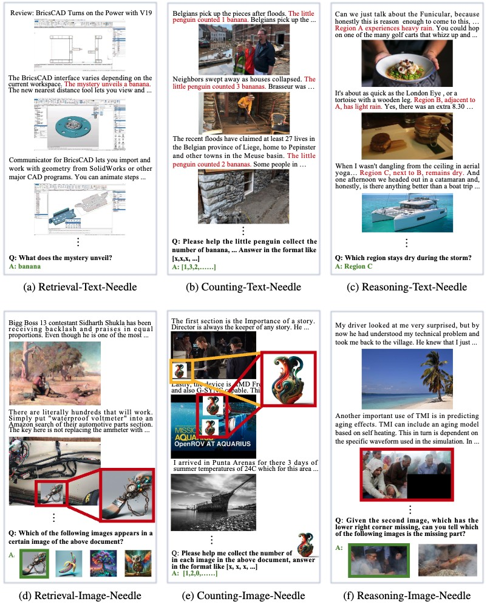
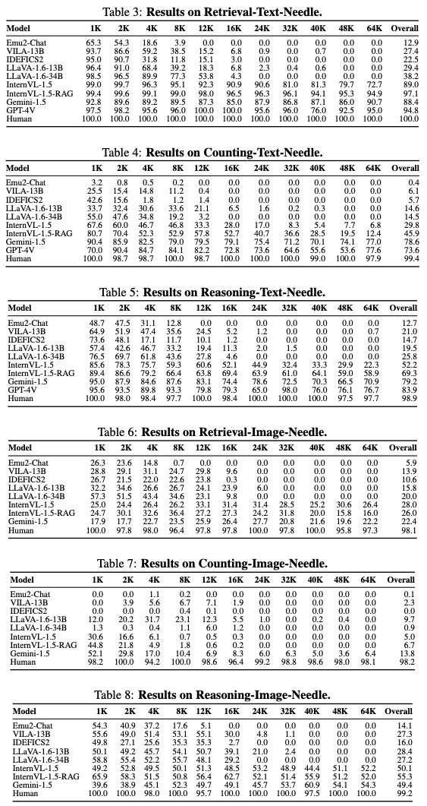

#  Needle In A Multimodal Haystack

[[Project Page](https://mm-niah.github.io/)]
[[arXiv Paper](http://arxiv.org/abs/2406.07230)]
[[Dataset](https://huggingface.co/datasets/OpenGVLab/MM-NIAH)]
[[Leaderboard](https://mm-niah.github.io/#overall_test_leaderboard)]
<!-- [[Github](https://github.com/OpenGVLab/MM-NIAH)] -->

## News🚀🚀🚀
- `2024/02/27`: MM-NIAH is accepted by NeurIPS 2024 Track Datasets and Benchmarks! 🎉
- `2024/07/04`: 🚀We have updated the performance of [InternVL2-Pro](https://internvl.github.io/blog/2024-07-02-InternVL-2.0/) on our leaderboard and support the evaluation of InternVL2-Pro.
- `2024/06/13`: 🚀We release Needle In A Multimodal Haystack ([MM-NIAH](https://huggingface.co/OpenGVLab/MM-NIAH)), the first benchmark designed to systematically evaluate the capability of existing MLLMs to comprehend long multimodal documents.
**Experimental results show that the performance of Gemini-1.5 on tasks involving image needles is no better than random guessing.**

## Introduction

Needle In A Multimodal Haystack (MM-NIAH) is a comprehensive benchmark designed to systematically evaluate the capability of existing MLLMs to comprehend long multimodal documents.
This benchmark requires the model to answer specific questions according to the key information scattered throughout the multimodal document.
The evaluation data in MM-NIAH consists of three tasks: `retrieval`, `counting`, and `reasoning`. The needles are inserted into either text or images in the documents. Those inserted into text are termed `text needles`, whereas those within images are referred to as `image needles`.
Please see [our paper](http://arxiv.org/abs/2406.07230) for more details.



## Main Findingds

Based on our benchmark, we conducted a series of experiments. The main findings are summarized as follows:

- The most advanced MLLMs (e.g. Gemini-1.5) still struggle to comprehend multimodal documents.

- **All MLLMs exhibit poor performance on image needles.**

- MLLMs fail to recognize the exact number of images in the document.

- Models pre-trained on image-text interleaved data do not exhibit superior performance.

- Training on background documents does not boost performance on MM-NIAH.

- The "Lost in the Middle" problem also exists in MLLMs.

- Long context capability of LLMs is NOT retained in MLLMs.

- RAG boosts Text Needle Retrieval but not Image Needle Retrieval.

- Placing questions before context does NOT improve model performance.

- Humans achieve near-perfect performance on MM-NIAH.


Please see [our paper](http://arxiv.org/abs/2406.07230) for more detailed analyses.

## Experimental Results

For the retrieval and reasoning tasks, we utilize Accuracy as the evaluation metric.

For the counting task, we use Soft Accuracy, defined as $\frac{1}{N} \sum_{i=1}^{N} \frac{m_i}{M_i}$, where $m_i$ is the number of matched elements in the corresponding positions between the predicted and ground-truth lists and $M_i$ is the number of elements in the ground-truth list for the $i$-th sample. Note that the required output for this task is a list.


<!-- <details> -->
<!-- <summary>Heatmaps (click to expand)</summary> -->

<!-- </details> -->

<!-- <details> -->
<!-- <summary>Tables (click to expand)</summary> -->

<!-- </details> -->

## Evaluation

To calculate the scores, please prepare the model responses in jsonl format, like this [example](outputs_example/example-retrieval-text.jsonl). Then you can place all jsonl files in a single folder and execute our script [calculate_scores.py](calculate_scores.py) to get the heatmaps and scores.

```shell
python calculate_scores.py --outputs-dir /path/to/your/responses
```

For example, if you want to reproduce the experimental results of [InternVL-1.5](https://huggingface.co/OpenGVLab/InternVL-Chat-V1-5), you should first install the environment following [the document](https://github.com/OpenGVLab/InternVL/blob/main/INSTALLATION.md) and download [the checkpoints](https://huggingface.co/OpenGVLab/InternVL-Chat-V1-5). Then you can execute the evaluation script [eval_internvl.py](eval_internvl.py) for InternVL to obtain the results, using the following commands:

```shell
sh shells/eval_internvl.sh
python calculate_scores.py --outputs-dir ./outputs/
```

If you want to reproduce the results of InternVL-1.5-RAG, please first prepare the retrieved segments using the following commands:

```shell
sh shells/prepare_rag.sh
```

Then, run these commands to obtain the results of InternVL-1.5-RAG:

```shell
sh shells/eval_internvl_rag.sh
python calculate_scores.py --outputs-dir ./outputs/
```

If you want to evaluate the model by LMDeploy, run the command to obtain the jsonl file of result in one task:

```shell
srun -p VC5 --gres=gpu:8 --ntasks=1 --ntasks-per-node=1 python ./mmniah_lmdeploy.py --file-name=retrieval-image --model-path=/path/to/your/model/ --file-dir=/path/to/MMNIAH/jsonl/dir/ --image-dir=/path/to/MMNIAH/image/dir/ --save-dir=/path/to/save/dir/
```

After obtaining all six result jsonl files, run the command to get the final test results:

```shell
python ./val_mmniah.py --file-dir /path/to/result/dir/
```

`NOTE`: Make sure that you install the [flash-attention](https://github.com/Dao-AILab/flash-attention) successfully, otherwise you will meet the torch.cuda.OutOfMemoryError.

## Leaderboard

🚨🚨 The leaderboard is continuously being updated.

To submit your results to the leaderboard on MM-NIAH, please send to [this email](mailto:wangweiyun@pjlab.org.cn) with your result jsonl files on each task, referring to the template file [example-retrieval-text.jsonl](outputs_example/example-retrieval-text.jsonl).
Please organize the result jsonl files as follows:

```
├── ${model_name}_retrieval-text-val.jsonl
├── ${model_name}_retrieval-image-val.jsonl
├── ${model_name}_counting-text-val.jsonl
├── ${model_name}_counting-image-val.jsonl
├── ${model_name}_reasoning-text-val.jsonl
├── ${model_name}_reasoning-image-val.jsonl
├──
├── ${model_name}_retrieval-text-test.jsonl
├── ${model_name}_retrieval-image-test.jsonl
├── ${model_name}_counting-text-test.jsonl
├── ${model_name}_counting-image-test.jsonl
├── ${model_name}_reasoning-text-test.jsonl
└── ${model_name}_reasoning-image-test.jsonl
```

## Visualization

If you want to visualize samples in MM-NIAH, please install `gradio==3.43.2` and run this script [visualization.py](visualization.py).

## Data Format

```python
{
    # int, starting from 0, each task type has independent ids.
    "id": xxx,
    # List of length N, where N is the number of images. Each element is a string representing the relative path of the image. The image contained in the "choices" is not included here, only the images in the "context" and "question" are recorded.
    "images_list": [
        "xxx",
        "xxx",
        "xxx"
    ],
    # str, multimodal haystack, "<image>" is used as the image placeholder.
    "context": "xxx",
    # str, question
    "question": "xxx",
    # Union[str, int, List], records the standard answer. Open-ended questions are str or List (counting task), multiple-choice questions are int
    "answer": "xxx",
    # meta_info, records various statistics
    "meta": {
        # Union[float, List[float]], range [0,1], position of the needle. If multiple needles are inserted, it is List[float].
        "placed_depth": xxx,
        # int, number of text and visual tokens
        "context_length": xxx,
        # int, number of text tokens
        "context_length_text": xxx,
        # int, number of image tokens
        "context_length_image": xxx,
        # int, number of images
        "num_images": xxx,
        # List[str], inserted needles. If it is a text needle, record the text; if it is an image needle, record the relative path of the image.
        "needles": [xxx, ..., xxx],
        # List[str], candidate text answers. If it is not a multiple-choice question or there are no text candidates, write None.
        "choices": [xxx, ..., xxx],
        # List[str], candidate image answers. The relative path of the image. If it is not a multiple-choice question or there are no image candidates, write None.
        "choices_image_path": [xxx, ..., xxx],
    }
}
```

`NOTE 1`: The number of `<image>` in the context and question equates to the length of the `images_list`.

`NOTE 2`: Save as a jsonl file, each line is a `Dict`.


## Contact
- Weiyun Wang: wangweiyun@pjlab.org.cn
- Wenhai Wang: wangwenhai@pjlab.org.cn
- Wenqi Shao: shaowenqi@pjlab.org.cn

## Acknowledgement

The multimodal haystack of MM-NIAH is build upon the documents from [OBELICS](https://github.com/huggingface/OBELICS).
Besides, our project page is adapted from [Nerfies](https://github.com/nerfies/nerfies.github.io) and [MathVista](https://github.com/lupantech/MathVista).

Thanks for their awesome work!

## Citation
```BibTex
@article{wang2024needle,
  title={Needle In A Multimodal Haystack},
  author={Wang, Weiyun and Zhang, Shuibo and Ren, Yiming and Duan, Yuchen and Li, Tiantong and Liu, Shuo and Hu, Mengkang and Chen, Zhe and Zhang, Kaipeng and Lu, Lewei and others},
  journal={arXiv preprint arXiv:2406.07230},
  year={2024}
}
```
