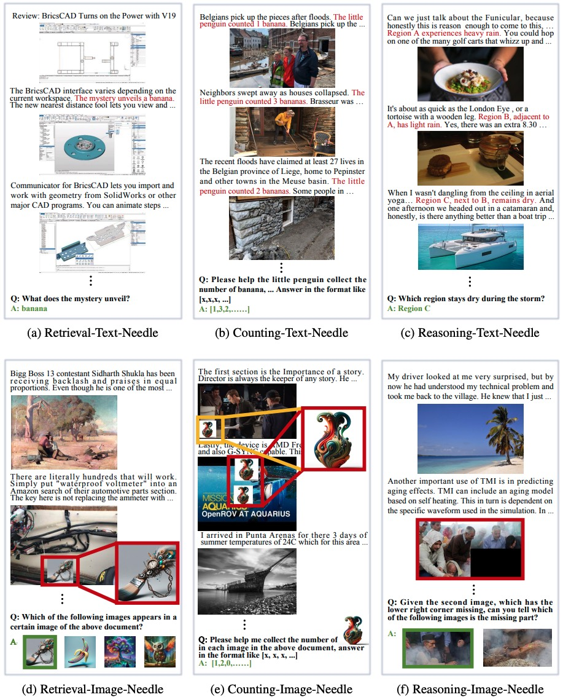
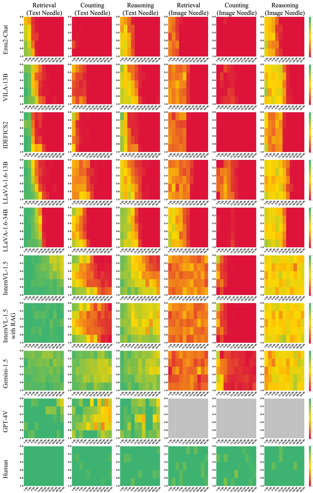
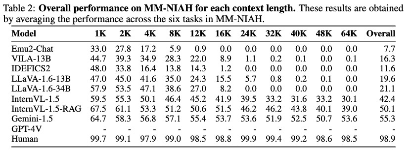

# Needle In A Multimodal Haystack

[[📊 Project Page]](https://mm-niah.github.io/)
[[📄 arXiv Paper]](http://arxiv.org/abs/2406.07230)
[[🤗 Dataset]](https://huggingface.co/OpenGVLab/MM-NIAH)
[[🏆 Leaderboard]](https://mm-niah.github.io/#leaderboard)
<!-- [[Github]](https://github.com/OpenGVLab/MM-NIAH) -->

## News🚀🚀🚀
- `2024/06/13`: 🚀We release Needle In A Multimodal Haystack ([MM-NIAH](https://huggingface.co/OpenGVLab/MM-NIAH)), the first benchmark designed to systematically evaluate the capability of existing MLLMs to comprehend long multimodal documents.

## Introduction

Needle In A Multimodal Haystack (MM-NIAH) is a comprehensive benchmark designed to systematically evaluate the capability of existing MLLMs to comprehend long multimodal documents.
This benchmark requires the model to answer specific questions according to the key information scattered throughout the multimodal document.
The evaluation data in MM-NIAH consists of three tasks: `retrieval`, `counting`, and `reasoning`. The needles are inserted into either text or images in the documents. Those inserted into text are termed `text needles`, whereas those within images are referred to as `image needles`.
Please see [our paper](http://arxiv.org/abs/2406.07230) for more details.



## Experimental Results

For the retrieval and reasoning tasks, we utilize Accuracy as the evaluation metric.

For the counting task, we use Soft Accuracy, defined as $\frac{1}{N}\sum_{i=1}^{N} \frac{m_i}{M_i}$, where $m_i$ is the number of matched elements in the corresponding positions between the predicted and ground-truth lists and $M_i$ is the number of elements in the ground-truth list for the $i$-th sample. Note that the required output for this task is a list.

<details>
<summary>Heatmaps (click to expand)</summary>

</details>

<details>
<summary>Tables (click to expand)</summary>


</details>

## Evaluation

To calculate the scores, please prepare the model responses in jsonl format, like this [example](outputs_example/example-retrieval-text.jsonl). Then you can place all jsonl files in a single folder and execute our script [calculate_scores.py](calculate_scores.py) to get the heatmaps and scores.

```shell
python calculate_scores.py --outputs-dir /path/to/your/responses
```

For example, if you want to reproduce the experimental results of [InternVL-1.5](https://huggingface.co/OpenGVLab/InternVL-Chat-V1-5), you should first install the environment following [the document](https://github.com/OpenGVLab/InternVL/blob/main/INSTALLATION.md) and download [the checkpoints](https://huggingface.co/OpenGVLab/InternVL-Chat-V1-5). Then you can execute the evaluation script [eval_internvl.py](eval_internvl.py) for InternVL to obtain the results, using the following commands:

```shell
sh shells/eval_internvl.sh
python calculate_scores.py --outputs-dir ./outputs/
```

If you want to reproduce the results of InternVL-1.5-RAG, please first prepare the retrieved segments using the following commands:

```shell
sh shells/prepare_rag.sh
```

Then, run these commands to obtain the results of InternVL-1.5-RAG:

```shell
sh shells/eval_internvl_rag.sh
python calculate_scores.py --outputs-dir ./outputs/
```

`NOTE`: Make sure that you install the [flash-attention](https://github.com/Dao-AILab/flash-attention) successfully, otherwise you will meet the torch.cuda.OutOfMemoryError.

## Visualization

If you want to visualize samples in MM-NIAH, please install `gradio==3.43.2` and run this script [visualization.py](visualization.py).

## Contact
- Weiyun Wang: wangweiyun@pjlab.org.cn
- Wenhai Wang: wangwenhai@pjlab.org.cn
- Wenqi Shao: shaowenqi@pjlab.org.cn

## Acknowledgement

The multimodal haystack of MM-NIAH is build upon the documents from [OBELICS](https://github.com/huggingface/OBELICS).

Thanks for their awesome work!

## Citation
```BibTex
@article{wang2024needle,
    title={Needle In A Multimodal Haystack}, 
    author={Wang, Weiyun and Zhang, Shuibo and Ren, Yiming and Duan, Yuchen and Li, Tiantong and Liu, Shuo and Hu, Mengkang and Chen, Zhe and Zhang, Kaipeng and Lu, Lewei and Zhu, Xizhou and Luo, Ping and Qiao, Yu and Dai, Jifeng and Shao, Wenqi and Wang, Wenhai},
    journal={arXiv preprint arXiv:2406.07230},
    year={2024}
}
```